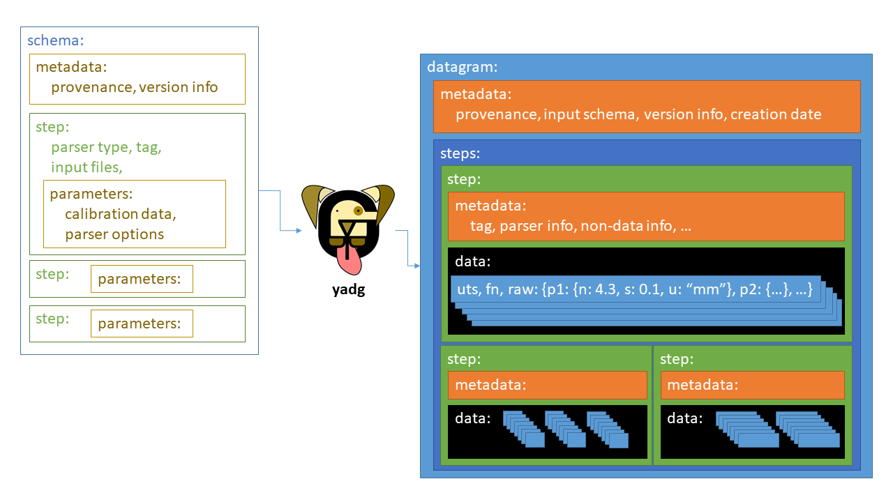

# 

Set of tools to process raw instrument data according to a `schema` into a standardised form called `datagram`, annotated with metadata, provenance information, timestamps, units, and uncertainties. Developed by the [Materials for Energy Conversion](https://www.empa.ch/web/s501) at Empa - Materials Science and Technology.

### Capabilities:
- Parsing **tabulated data** using CSV parsing functionality, including Bronkhorst and DryCal output formats. Columns can be post-processed using any linear combinations of raw and processed data using the calibration functionality.
- Parsing **chromatography data** from gas and liquid chromatography, including several Agilent, Masshunter, and Fusion formats. If a calibration file is provided, the traces are automatically integrated using built-in integration routines.
- Parsing **reflection coefficient** traces from network analysers. The raw data can be fitted to obtain the quality factor and central frequency using several algorithms.
- Parsing **potentiostat files** for electrochemistry applications. Supports BioLogic file formats.

### Features:
- timezone-aware timestamping using Unix timestamps
- automatic uncertainty determination using data contained in the raw files, instrument specification, or last significant digit
- uncertainty propagation to derived quantities
- tagging of data with units
- extensive `schema` and `datagram` validation using provided specifications
- mandatory metadata (such as provenance) is enforced

### Contributors:
- [Peter Kraus](http://github.com/PeterKraus)
- [Nicolas Vetsch](http://github.com/vetschn)
